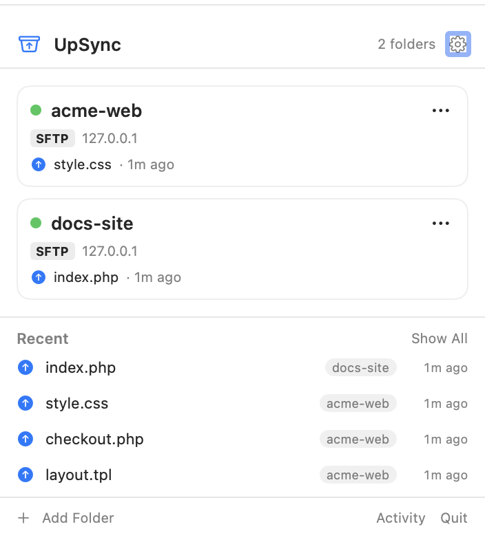
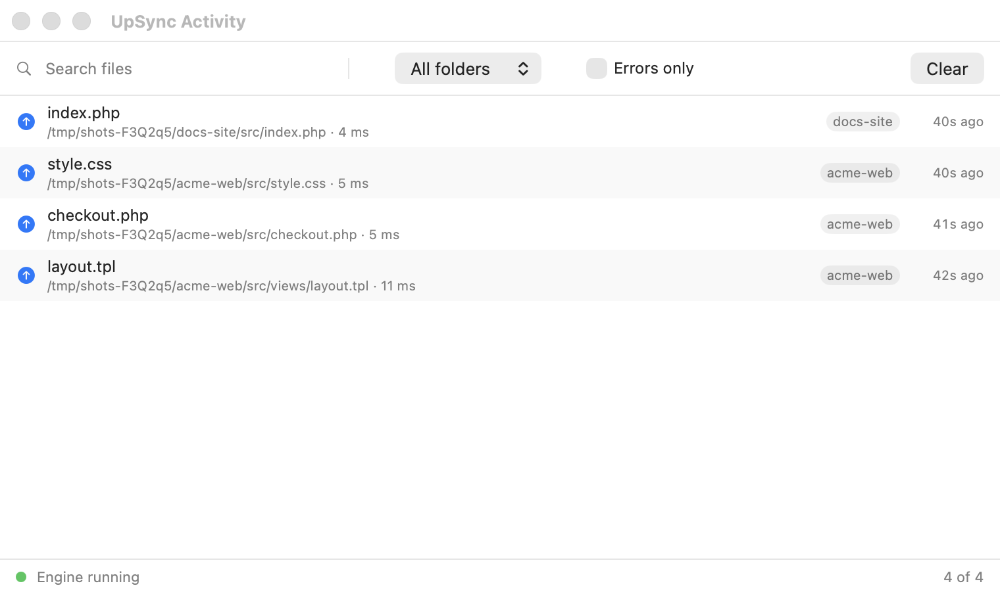
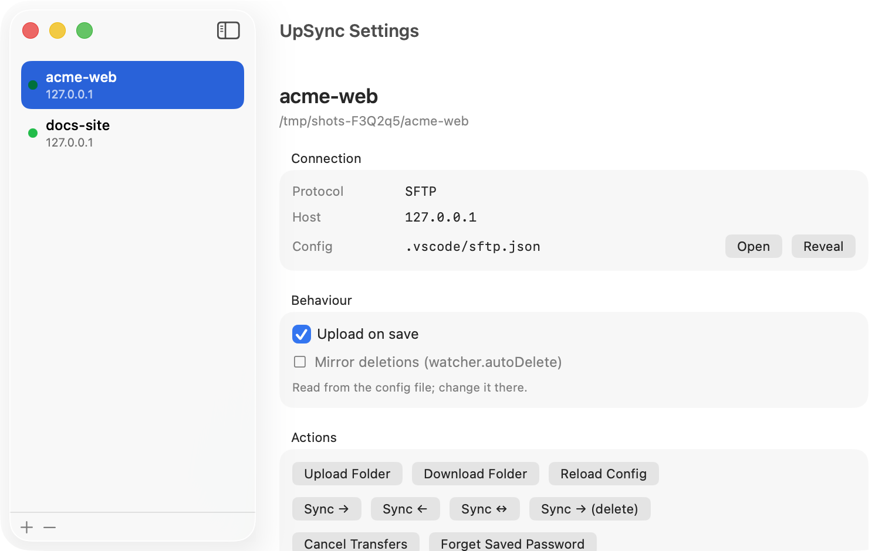

<div align="center">


# UpSync

**Save a file. It's on the server.**

A macOS menu bar app that watches your project folders and uploads every saved
file over SFTP or FTP. No editor plugin, no build step, no thinking about it.

[](LICENSE)
[](#requirements)
[](https://github.com/yavuz/UpSync/releases/latest)

*English · [Türkçe](README.tr.md)*



</div>

---

## Why

Most upload-on-save tools live inside one editor. Move to a different editor and
you lose them — or worse, they silently stop working for certain file types.

UpSync watches the filesystem instead. It does not care whether you saved from
Zed, VS Code, PhpStorm, Vim, or a shell script. If the file changed, it goes up.

It reads the same `sftp.json` format as
[vscode-sftp](https://github.com/Natizyskunk/vscode-sftp), so existing project
configs work unchanged.

## Install

**Download the latest release** → [Releases](https://github.com/yavuz/UpSync/releases/latest)

1. Unzip and drag `UpSync.app` to **Applications**
2. First launch: right-click the app → **Open** (the build is ad-hoc signed, not
   notarized), or run:
   ```bash
   xattr -dr com.apple.quarantine /Applications/UpSync.app
   ```
3. Click the menu bar icon → **Add Folder**

### Requirements

- macOS 14 or later
- **Node.js 18+** — the sync engine runs on it. UpSync looks for Node in this
  order: bundled → `/opt/homebrew/bin` → `/usr/local/bin` → `/usr/bin` → your
  login shell's `PATH` (so nvm, Herd, fnm all work).
  ```bash
  brew install node
  ```

### Build from source

```bash
git clone https://github.com/yavuz/UpSync.git
cd UpSync
./build.sh
```

Produces `build/UpSync.app`. Needs Xcode 15+ / Swift 6 in addition to Node.

## Quick start

Create `.vscode/sftp.json` (or `.zed/sftp.json`, or `sftp.json`) in your project:

```jsonc
{
  "host": "example.com",
  "username": "deploy",
  "privateKeyPath": "~/.ssh/id_rsa",
  "remotePath": "/var/www/site",
  "uploadOnSave": true,
  "ignore": ["**/node_modules/**", "**/.git/**", "*.log"]
}
```

Add the folder in UpSync, save a file, and watch it appear in the activity list.

## What you get



- **Upload on save** — any file type, any editor, any extension
- **Live progress** — see files in flight during large folder syncs
- **Nothing fails silently** — every upload, skip and error is visible, with the
  error text and the file path
- **Manual upload / download / sync**, including two-way sync
- **Multiple profiles** — staging and production per folder
- **SFTP and FTP/FTPS**
- **Passwords in the Keychain**, not in your config file
- **gitignore-style ignore patterns**, plus `ignoreFile` support



## Configuration

UpSync looks for a config file in this order:

1. `.zed/sftp.json`
2. `.vscode/sftp.json`
3. `sftp.json`

Comments and trailing commas (JSONC) are supported. The panel shows which file
it actually loaded, so there is never a guess.

<details>
<summary><b>Full config reference</b></summary>

```jsonc
{
  "name": "Production",
  "host": "example.com",
  "protocol": "sftp",          // "sftp" | "ftp"
  "port": 22,
  "username": "deploy",

  // Pick one: key (recommended), password, or "password": true to be
  // prompted once and stored in the Keychain.
  "privateKeyPath": "~/.ssh/id_rsa",
  "passphrase": true,
  "password": true,

  "remotePath": "/var/www/site",
  "context": "src",            // only sync this subdirectory

  "uploadOnSave": true,
  "watcher": {
    "autoUpload": true,        // equivalent to uploadOnSave
    "autoDelete": false        // delete remotely when deleted locally
  },

  "ignore": ["**/node_modules/**", "**/.git/**", "*.log"],
  "ignoreFile": ".gitignore",

  "syncOption": {
    "delete": false,           // remove remote files missing locally
    "skipCreate": false,
    "ignoreExisting": false,
    "update": false            // only overwrite older files
  },

  "concurrency": 4,
  "connectTimeout": 10000,
  "useTempFile": false,        // upload to a temp file, then rename
  "filePerm": 644,
  "dirPerm": 755,

  "profiles": {
    "staging": {
      "host": "staging.example.com",
      "remotePath": "/var/www/staging"
    }
  }
}
```

SSH config parsing, agent authentication and jump hosts are inherited from the
vscode-sftp engine and work the same way.

</details>

### Ignore rules

Patterns use **gitignore semantics**, not glob semantics:

- A bare name like `CLAUDE.md` matches **at every directory level**
- A pattern with a path like `tests/fixtures/**` matches **only from the root**
- `**/cache/**` ignores the directory's *contents*, not the directory itself.
  Add `**/cache` too if you want it skipped entirely.

### uploadOnSave vs. watcher.autoUpload

vscode-sftp treats these separately — one means an editor save, the other an
external change. UpSync has a single watcher, so a folder is watched if
**either** is on. Existing configs need no changes.

### Passwords

Set `"password": true`. UpSync asks once, stores it in the Keychain under
`user@host:port`, and never asks again. Clear it with **Forget Saved Password**.

Using an SSH key is still better.

## Troubleshooting

<details>
<summary><b>"UpSync can't be opened because Apple cannot check it"</b></summary>

The release is ad-hoc signed, not notarized with a paid Apple Developer
account. Right-click the app → **Open**, or:

```bash
xattr -dr com.apple.quarantine /Applications/UpSync.app
```
</details>

<details>
<summary><b>"Node.js not found"</b></summary>

Install Node 18 or later:

```bash
brew install node
```

If you use nvm or Herd, UpSync reads your login shell's `PATH`, so make sure
`node` is on it in a fresh terminal.
</details>

<details>
<summary><b>Nothing uploads when I save</b></summary>

Open the panel and check the folder card:

- A red dot with an error message means the config failed to load or the
  connection failed — the message says which.
- "uploadOnSave is off in the config" means neither `uploadOnSave` nor
  `watcher.autoUpload` is `true`.
- The file may match an `ignore` pattern — the activity window logs skips.
</details>

<details>
<summary><b>My files uploaded twice</b></summary>

Two copies of UpSync were probably running. Quit both from the menu bar and
launch one. (Since 0.2.0 the engine shuts down with its parent, so this should
no longer happen.)
</details>

<details>
<summary><b>A file seems stuck — no error, no progress</b></summary>

If the connection dies silently mid-transfer (laptop sleep, a network change,
a half-open TCP connection), the transfer used to hang forever with no error
and no way to retry. As of 0.2.1, a stuck transfer is declared failed after a
timeout, and UpSync probes the connection before deciding whether to close
it — if other transfers are still going through, or the probe gets any reply
at all, the connection is left alone and only that one file is marked
failed; it's only torn down and reconnected when the probe itself gets no
answer either (a genuinely dead connection). This matters when a burst of
file changes (e.g. from a coding agent editing many files at once) hits the
server at the same time — one slow file no longer takes the others down
with it.

When that happens, the failed entry in the Activity window gets a retry
icon — click it to resend just that file, or use **Retry All** in the
toolbar to resend every failed file at once (each file only once, even if it
failed more than once). Right-click an entry for **Dismiss** if you just want
to clear it without retrying.
</details>

## How it runs

UpSync is two processes: the menu bar app and a Node engine it spawns as a
child. The engine is what watches files and talks SFTP — one instance, started
when the app launches.

Quitting the app (**Quit**, ⌘Q) shuts the engine down with it, in well under a
second. If the app is force-quit or crashes, the engine notices its parent is
gone and exits within ~2 seconds. Launching the app again reuses the single
running instance rather than starting a second one, so engines never
accumulate.

Verified on the packaged app:

| | engine after |
|---|---|
| Quit / ⌘Q | gone in ~0.5 s |
| SIGTERM | gone in ~2 s |
| Force quit (SIGKILL) | gone in ~2 s |
| open → quit, ×3 | none left over |

Idle cost is one Node process at ~38 MB and 0% CPU.

## Under the hood

    ┌─────────────────────────────┐
    │  SwiftUI menu bar (app/)    │  panel, activity, settings, Keychain
    └───────────┬─────────────────┘
                │ newline-delimited JSON-RPC over stdio
    ┌───────────▼─────────────────┐
    │  Node engine (engine/)      │  FSEvents watcher, ssh2 + ftp,
    │  esbuild → single file      │  transfer/sync algorithm, ignore rules
    └─────────────────────────────┘

The transfer core is ported from
[vscode-sftp](https://github.com/Natizyskunk/vscode-sftp) with every vscode
dependency replaced by a shim. The Swift app supervises the engine and restarts
it with exponential backoff.

**Two upstream bugs were fixed during the port:**

1. `sshClient.ts` registered a listener's *return value* (`undefined`) instead
   of a function, and called `end()` mid-connect. Node 22 rejects `undefined`
   listeners, so the connection never opened.
2. `transfer.ts` fired sync deletions inside `forEach` without awaiting them, so
   `sync()` returned early and deletion errors were swallowed.

**Save-to-server latency is ~150 ms**, most of which is deliberate: chokidar
waits for the file size to stop changing before uploading, so a half-written
file never goes up. Measured against a process writing a 3 MB file in chunks:

| stability threshold | latency | large file |
|---|---|---|
| 200 ms (was) | 316 ms | complete |
| **100 ms (now)** | **117 ms** | complete |
| 50 ms | 102 ms | complete |
| off | 101 ms | **truncated** |

End to end on an 8000-file tree: watcher ready in ~300 ms, single save lands in
154 ms, a 100-file burst finishes in 313 ms (320 files/sec), engine idles at
38 MB.

**Round trips matter more than CPU** once a real server is involved. An upload
costs 6 SFTP protocol calls; each one is a round trip. Permissions and
timestamps used to be two separate `FSETSTAT` packets and are now merged into
one, which removes exactly one round trip per file. Measured against a test
server with 40 ms of simulated latency, isolating the protocol path (n=20):

| | median |
|---|---|
| separate (7 calls) | 255.7 ms |
| **merged (6 calls)** | **213.6 ms** |

**File watching** uses FSEvents (chokidar 3 + `fsevents`) — one stream for the
whole tree. chokidar 4 dropped FSEvents on macOS and falls back to one
`fs.watch` per path; combined with the 256-descriptor soft limit that launchd
gives GUI apps, that produced `EMFILE` errors on real projects. Measured on a
1603-directory tree: **44 open descriptors, 86 MB RSS**.

**Tested** with 68 end-to-end tests covering SFTP and FTP upload/download/sync,
ignore rules, the Keychain password flow, per-file progress events, low
descriptor limits, and orphan shutdown. Tests spin up throwaway ssh2 and
`ftp-srv` servers on localhost — no real server is ever contacted.

```bash
cd engine && npm install && npm test
```

## Releasing

`VERSION` is the single source of truth.

```bash
./release.sh 0.2.0
```

Runs tests, builds, verifies the version inside the bundle, zips with `ditto`
(preserving the signature), tags, pushes, and publishes to GitHub Releases.

## App icon

Drawn programmatically in `icon/render.swift` — no binary asset, every size
regenerated from one source with `./icon/make-icns.sh`.

The artwork is full-bleed on purpose. macOS 26 places legacy `.icns` icons on
its own standard tile, so drawing our own rounded rectangle produced a doubled
frame. On macOS 15 and earlier this means the icon has square corners; the
proper fix is to ship an Icon Composer `.icon` asset as well.

## License

MIT — see [LICENSE](LICENSE).

Transfer engine derived from
[vscode-sftp](https://github.com/Natizyskunk/vscode-sftp) (MIT, Natizyskunk;
originally by liximomo).
